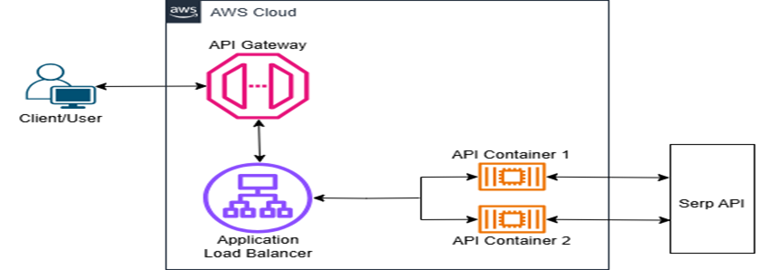

# Sports API Management System
**Project Overview:** The Sports API Management System is a containerized API management solution designed to query real-time sports data. It leverages Amazon ECS (Fargate), Amazon API Gateway, and an external Sports API. Below is the project architecture:
- User Requests: Clients interact with the system via REST endpoints exposed through Amazon API Gateway.
- API Gateway: Routes requests securely to backend services.
- ECS (Fargate) Containers: Hosts and runs the API management logic.
- External Sports API: Provides real-time sports data.
- AWS Services: IAM for security


---

## Features
- Containerized Deployment: Utilizes Amazon ECS (Fargate) for running stateless, scalable containers.
- API Management: Exposes endpoints securely via Amazon API Gateway.
- Real-Time Sports Data: Fetches and serves data from an external Sports API.
- AWS Integration: Implements IAM roles, and security policies
- Scalability & Reliability: Ensures smooth performance with load balancing.

---

## Prerequisites
- **Sports API Key**: Sign up for a free account and subscription & obtain your API Key at [serpapi](https://serpapi.com)
- **AWS Account**: Create an AWS Account & have basic understanding of ECS, API Gateway, Docker & Python
- **AWS CLI Installed and Configured**: Install & configure AWS CLI to programatically interact with AWS
- **Serpapi Library**: Install Serpapi library in local environment "pip install google-search-results"
- **Docker CLI Installed**: To build & push container images `apt install docker.io`

---

## Setup ECR and Docker
1. **Clone the Repository**
```bash
git clone https://github.com/PeterOyelegbin/sports-mgt-api
cd sports-mgt-api
```

2. **Create ECR Repo**
```bash
aws ecr create-repository --repository-name sports-api --region us-east-1
```


3. **Authenticate**
```bash
aws ecr get-login-password --region us-east-1 | docker login --username AWS --password-stdin <AWS_ACCOUNT_ID>.dkr.ecr.us-east-1.amazonaws.com
```


4. **Build the Docker Image**
```bash
docker build --platform linux/amd64 -t sports-api .
```


5. **Tag the Docker Image**
```bash
docker tag sports-api:latest <AWS_ACCOUNT_ID>.dkr.ecr.us-east-1.amazonaws.com/sports-api:sports-api-latest
```


6. **Push the Docker Image**
```bash
docker push <AWS_ACCOUNT_ID>.dkr.ecr.us-east-1.amazonaws.com/sports-api:sports-api-latest
```


---

## Set Up ECS Cluster with Fargate
1. **Create an ECS Cluster:**
  - Go to the ECS Console → Clusters → Create Cluster
  - Name your Cluster (sports-api-cluster)
  - For Infrastructure, select Fargate, then create Cluster
  

2. **Create a Task Definition:**
  - Go to Task Definitions → Create New Task Definition
  - Name your task definition (sports-api-task)
  - For Infrastructure, select Fargate
  
  - Add the container:
    - Name your container (sports-api-container)
    - Image URI: `<AWS_ACCOUNT_ID>.dkr.ecr.us-east-1.amazonaws.com/sports-api:sports-api-latest`
    - Container Port: 8080
    - Protocol: TCP
    - Port Name: Leave Blank
    - App Protocol: HTTP
  
  - Define Environment Eariables:
    - Key: SPORTS_API_KEY
    - Value: <YOUR_SPORTSDATA.IO_API_KEY>
    - Create task definition
  

3. **Run the Service with an ALB**
  - Go to Clusters → Select Cluster → Service → Create.
  - Capacity provider: Fargate
  - Select Deployment configuration family (sports-api-task)
  - Name your service (sports-api-service)
  - Desired tasks: 2
  
  - Networking: Create new security group
  - Networking Configuration:
    - Type: All TCP
    - Source: Anywhere
  
  - Load Balancing: Select Application Load Balancer (ALB).
  - ALB Configuration:
  - Create a new ALB:
  - Name: sports-api-alb
  
  - Target Group health check path: "/sports"
  - Create service
  

4. **Test the ALB:**
  - After deploying the ECS service, note the DNS name of the ALB ` sports-api-alb-<AWS_ACCOUNT_ID>.us-east-1.elb.amazonaws.com`
  - Confirm the API is accessible by visiting the ALB DNS name in your browser and adding /sports at end `http://sports-api-alb-<AWS_ACCOUNT_ID>.us-east-1.elb.amazonaws.com/sports`

---

## Configure API Gateway
1. **Create a New REST API:**
  - Go to API Gateway Console → Create API → REST API
  - Name the API (e.g., Sports API Gateway)
  

2. **Set Up Integration:**
  - Create a resource /sports
  
  - Create a GET method
  - Choose HTTP Proxy as the integration type
  - Enter the DNS name of the ALB that includes "/sports" `http://sports-api-alb-<AWS_ACCOUNT_ID>.us-east-1.elb.amazonaws.com/sports`
  

3. **Deploy the API:**
  - Deploy the API to a stage (e.g., prod)
  - Note the endpoint URL
  

---

## Test the System
- Use curl or a browser to test:
```bash
curl https://<api-gateway-id>.execute-api.us-east-1.amazonaws.com/prod/sports
```


---

## What We Learned
Setting up a scalable, containerized application with ECS
Creating public APIs using API Gateway.

---

## Conclusion
This project demonstrates advanced cloud computing practices, including API management, container orchestration, and secure AWS integrations.
